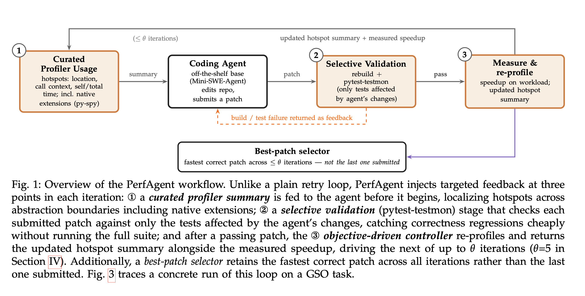
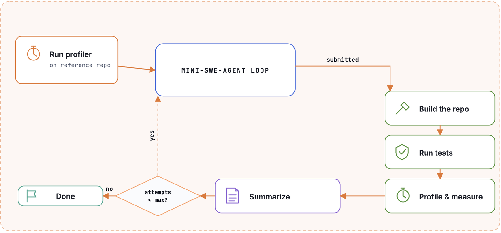

# PerfAgent

**Profiler-Guided Iterative Refinement for Repository-Level Code Optimization**

Ryan Deng (MIT), Yuanzhe Liu (RPI), Bastian Lipka (IBM), Yao Ma (RPI), Xuhao Chen (Michigan State), Tim Kaler (MIT)&dagger;, Jatin Ganhotra (IBM Research)&dagger;
&dagger; co-senior authors

[arXiv:2607.19653](https://arxiv.org/abs/2607.19653) (cs.SE)

This repository is the harness used to run and evaluate PerfAgent on the [GSO](https://github.com/gso-bench/gso) and [SWE-fficiency](https://github.com/swefficiency/swefficiency) benchmarks.

<p align="center">
  
</p>

<p align="center"><sub>Figure 1 from the paper: PerfAgent wraps a coding agent with a profiler, a loop controller, and selective test validation.</sub></p>

> **On two challenging optimization benchmarks, GSO and SWE-fficiency-Lite, PerfAgent more than doubles the rate of expert-matching patches over OpenHands with GPT-5.1, improving from 19.6% to 39.2% on GSO and from 26% to 74% on SWE-fficiency-Lite.**

> [!IMPORTANT]
> **One artifact is still missing from this release: `test_db`, the per-instance archives of stable tests.** The harness reads them to decide which tests validate each patch, so a benchmark run stops with a `FileNotFoundError` until they are in place. Everything else in this repository is complete: you can install the package, inspect the configs and prompts, and read the paper's released results in [`artifacts/`](#artifacts). Publishing `test_db` is the first item in [`TODOs.md`](TODOs.md). See [Test DB](#test-db-required-not-yet-published) for the required layout and the current status.

## Table of contents

- [How it works](#how-it-works)
- [Benchmarks](#benchmarks)
- [Results](#results)
- [Prerequisites](#prerequisites)
- [Install](#install)
- [Quickstart](#quickstart)
- [CLI reference](#cli-reference)
- [Configuration](#configuration)
- [Test DB (required, not yet published)](#test-db-required-not-yet-published)
- [Docker images](#docker-images)
- [Code layout](#code-layout)
- [artifacts/](#artifacts)
- [Reproducing the paper](#reproducing-the-paper)
- [FAQ / troubleshooting](#faq--troubleshooting)
- [License](#license)
- [Citation](#citation)

## How it works

PerfAgent wraps an off-the-shelf coding agent ([Mini-SWE-Agent](https://github.com/SWE-agent/mini-swe-agent)) with three feedback mechanisms. Each one targets a specific failure mode of plain agentic optimization.

1. **Curated profiler usage**, against missing the real bottleneck.
   The agent gets a [py-spy](https://github.com/benfred/py-spy) sampling profile instead of a guess. py-spy samples at 100 Hz over a minimum 10-second window. It captures both Python and native-extension frames. `cProfile`, by contrast, sees Python code only and adds high overhead. The harness removes setup frames from the samples. The remaining samples form hotspots with location, call stack, self-time, total-time, sample share, and an external-library flag. A separate LLM call turns this into a short natural-language summary for the agent.

2. **Objective-driven loop controller**, against premature termination.
   When the agent signals STOP, the harness does not end the run. It applies the patch, rebuilds the repository, revalidates it, and profiles it again. It then reports the updated hotspots and the measured speedup, and asks the agent to continue, for up to `theta = 5` iterations. A best-patch selector tracks the fastest CORRECT patch across all iterations. It reports that patch, not the last one the agent submitted.

3. **Selective validation**, against insufficient testing.
   [pytest-testmon](https://github.com/tarpas/pytest-testmon) runs only the tests whose coverage overlaps the agent's changes. This catches regressions without the cost of the full suite on every iteration. A failing test is returned to the agent as feedback. This cuts the number of tests run by 66-99% on GSO and 47-98% on SWE-fficiency-Lite.

The measurement layer discourages reward hacking on its own. The reported timing is the *first* run only, not an average over the profiling loop's repeated executions. Caching results across timing iterations therefore cannot inflate the score. In one ablation, this change dropped flagged reward hacks from 18 to 3.

### Pipeline

1. Input: a repository checked out at a commit, plus a workload script.
2. Baseline profile: run the workload once, profile it, summarize the hotspots.
3. Agent turn: the agent reads the profile and edits the repository.
4. Intercept STOP: when the agent tries to end the run, the harness catches it instead of exiting.
5. Rebuild and selectively validate: rebuild the repo, run only the tests that cover the diff. A failure returns to the agent as feedback and the loop continues.
6. Measure and re-profile: time the workload (first run only) and take a fresh profile.
7. Best-patch selector: record this attempt if it is a correct, faster patch than the current best.
8. Loop while iterations `< theta` (default 5), back to step 3.
9. Output: the fastest correct patch found across all iterations.

<p align="center">
  
</p>

<p align="center"><sub>Operational view of the same loop, from the paper.</sub></p>

## Benchmarks

| Benchmark | Repos | Tasks | Median expert speedup | Median expert patch size (LOC) | Language mix (Python / C+C++ / Cython / Rust) |
|---|---|---|---|---|---|
| [GSO](https://github.com/gso-bench/gso) | 10 | 102 | 2.43x | 140 | 41% / 45% / 10% / 4% |
| [SWE-fficiency-Lite](https://github.com/swefficiency/swefficiency) | 9 | 100 | 3.57x | 20 | 88% / 1% / 11% / 0% |

GSO has hidden performance tests beyond the workload script the agent can see. SWE-fficiency-Lite is a 100-task random subset of SWE-fficiency with no hidden tests.

**Metrics**

- **SR** (speedup ratio) = agent speedup / human-expert speedup.
- **Opt@1** = percent of tasks that are correct AND have SR &ge; 0.95.
- **Sp@1** = percent of tasks with at least 1.2x speedup over the base repository.
- **Correctness** = percent of tasks passing the benchmark's correctness tests.
- **Hack-Adj.** = Opt@1 recomputed after removing patches flagged by the combined reward-hacking detector.

## Results

All numbers below are GPT-5.1, from the paper. Columns are Correctness / Sp@1 / Opt@1 / Hack-Adj., all in percent. `A_L` is the loop controller alone. `+Tests` and `+Profiler` each add one mechanism to `A_L`. `PerfAgent` combines all three.

### GSO

| Method | Correctness | Sp@1 | Opt@1 | Hack-Adj. |
|---|---|---|---|---|
| OpenHands | 88.2 | 46.1 | 20.6 | 19.6 |
| Codex | 89.2 | 48.0 | 18.6 | 17.7 |
| A_L (loop only) | 91.2 | 67.6 | 33.3 | 29.4 |
| +Tests | 96.1 | 47.1 | 24.5 | 20.6 |
| +Profiler | 95.1 | 70.6 | 36.3 | 34.4 |
| **PerfAgent** | **96.1** | **77.5** | **44.1** | **39.2** |

### SWE-fficiency-Lite

| Method | Correctness | Sp@1 | Opt@1 | Hack-Adj. |
|---|---|---|---|---|
| OpenHands | 82 | 47 | 27 | 26 |
| Codex | 80 | 59 | 39 | 39 |
| A_L (loop only) | 80 | 64 | 49 | 46 |
| +Tests | 93 | 64 | 49 | 46 |
| +Profiler | 83 | 73 | 59 | 57 |
| **PerfAgent** | **90** | **83** | **75** | **74** |

### Cost

| Benchmark | PerfAgent, $/task | OpenHands best@5 (oracle judge), $/task |
|---|---|---|
| GSO | $2.88 | $11.01 |
| SWE-fficiency-Lite | $4.25 | $9.91 |

PerfAgent scores higher than OpenHands best@5 on Opt@1 and Hack-Adj. on both benchmarks, and costs less per task.

## Prerequisites

- Python 3.12 or newer.
- [`uv`](https://docs.astral.sh/uv/).
- A running Docker daemon. Task containers start with `--cap-add=SYS_PTRACE --cap-add=LINUX_IMMUTABLE --security-opt=seccomp=unconfined` (`src/perfagent/spec.py:6-11`). `SYS_PTRACE` lets `py-spy --native` attach to the workload process. `LINUX_IMMUTABLE` lets the harness mark the build, test, and profiler scripts read-only inside the container (`chattr +i`), so the agent cannot edit them. **Rootless Docker and many CI runners refuse these capabilities.** Run this on a host with a standard root-mode Docker daemon.
- Docker images pulled per instance from Docker Hub (`ryandeng1/perfagent:{benchmark}.{instance_id}`). Each task has its own image, built for that repository at that commit. Image sizes are not measured or recorded anywhere in this repository, so budget disk space conservatively before a full run. `py-spy` itself runs *inside* the container, as part of the image. Do not install `py-spy` on the host.
- The `test_db` artifact. **Not yet published.** See [Test DB](#test-db-required-not-yet-published) below. Without it, no real instance can run.
- A Hugging Face token in `HF_TOKEN`, and an LLM provider key in `OPENAI_API_KEY`. The harness refuses to start without `HF_TOKEN`, even though only 7 of the 202 tasks download anything from Hugging Face. See [Environment variables](#environment-variables).

## Install

```bash
git clone https://github.com/MITIBM-FastCoder/PerfAgent.git
cd PerfAgent
uv sync
```

`uv sync` creates `.venv/` and installs the `perfagent` command into it. Run the command through `uv run perfagent`, as shown below. `uv run` also syncs the environment first, so a separate `uv sync` is optional.

Check the install without touching Docker or any API:

```bash
uv run perfagent --help
```

## Quickstart

```bash
export HF_TOKEN=...          # required for every run, even when the task never uses it
export OPENAI_API_KEY=...    # required for the shipped GPT-5.1 configs

uv run perfagent \
  --benchmark gso \
  --config-path configs/gso.yaml \
  --instance-id numpy__numpy-09db9c7 \
  --output-path outputs/ \
  --traj-path trajs/
```

The first import of `mini-swe-agent` prints a startup banner and writes a config file under the OS app-data directory (e.g. `~/Library/Application Support/mini-swe-agent/.env` on macOS). This is harmless. It is not related to PerfAgent's own config.

Outputs, per instance:

- `outputs/<instance_id>/opt_attempts.json`: a list of `{runtime, speedup, perf_report, diff}`, one entry per optimization attempt the agent made.
- `trajs/<instance_id>/traj.json`: the full agent trajectory.

## CLI reference

`perfagent` runs exactly one benchmark instance per invocation.

| Flag | Required | Meaning |
|---|---|---|
| `--benchmark {gso,swefficiency}` | yes | Which benchmark adapter to use. |
| `--config-path PATH` | yes | Path to a run-config YAML (see [Configuration](#configuration)). |
| `--instance-id STR` | one of these two | Instance to run, by id. Mutually exclusive with `--run-id`. |
| `--run-id INT` | one of these two | Instance to run, by dataset row index (useful for array jobs). Mutually exclusive with `--instance-id`. |
| `--output-path PATH` | yes | Directory to write `<instance_id>/opt_attempts.json` into. |
| `--traj-path PATH` | yes | Directory to write `<instance_id>/traj.json` into. |
| `--test-db-root PATH` | no | Overrides `benchmark.test_db_root` from the config file. |

(source: `src/perfagent/cli.py:20-33`)

## Configuration

A run config is a YAML file with exactly four possible top-level keys: `benchmark`, `agent`, `environment`, `model`. Any other top-level key raises a `ValueError` (`cli.py:38-43`). `benchmark` is mandatory.

| Key | Required | Meaning |
|---|---|---|
| `benchmark.dataset` | yes | Hugging Face dataset id: `gso-bench/gso` or `swefficiency/swefficiency_lite`. |
| `benchmark.split` | no | Dataset split, default `"test"`. |
| `benchmark.test_db_root` | yes, unless `--test-db-root` is passed | Root directory of the `test_db` artifact. See [Test DB](#test-db-required-not-yet-published). |
| `agent.*` | no | Maps to `PerfAgentConfig` / mini-swe-agent's `AgentConfig`. Jinja2 templates: `system_template`, `instance_template`, `action_observation_template`, `format_error_template`, `runtime_error_template`, `test_script_perf_template`, `perf_summary_template`, `duplicate_submission_template`. Plus `step_limit`, `cost_limit`, `max_attempts` (default 5). `action_regex`, `build_command` (default `/build.sh`), `test_command` (default `/run_tests.sh`), `profile_command`, `reference_profile_command`, and `workload_script` are defaulted in code and rarely need overriding. |
| `environment.env` | no | Dict merged into the container's environment. |
| `environment.timeout` | no | Command timeout in seconds, default 7200 (`spec.py:42`). Any key under `environment` other than `env`/`timeout` raises a `ValueError` (`workspace.py:35-36`). |
| `model.model_class` / `model.model_name` / `model.model_kwargs` | no | Passed to `minisweagent.models.get_model`. |

`configs/gso.yaml` and `configs/swefficiency.yaml` are the exact configs used for the paper's PerfAgent (GPT-5.1) results.

### Environment variables

| Variable | Required | Notes |
|---|---|---|
| `HF_TOKEN` | Yes, for every run, on both benchmarks. | `cli.py:49` exits with status 1 if this is unset, whichever instance you run. The token is forwarded into the container (`spec.py:39`), where the workload script uses it. Only 7 of the 202 tasks actually need it. See [Which instances need `HF_TOKEN`](#which-instances-need-hf_token) below. Export a token even for a run that never contacts Hugging Face. |
| `OPENAI_API_KEY` | Yes, in practice, for the shipped configs. Not currently checked at startup. | The shipped configs set `model.model_name` to `openai/gpt-5.1-2025-11-13`. `src/perfagent/model.py:9-42` (`PerfLitellmModel`, a `LitellmModel` subclass from mini-swe-agent) calls `litellm.completion()`. litellm resolves the `openai/` prefix by reading `OPENAI_API_KEY` from the environment. Without it, the run passes the `HF_TOKEN` check and then fails with a litellm `AuthenticationError`. To use a different provider, edit `model.model_name` in the YAML to any [litellm-supported model id](https://docs.litellm.ai/docs/providers) and set that provider's key env var instead. There is no CLI flag for model selection. |

#### Which instances need `HF_TOKEN`

The token is needed **inside the container**, not on the host. It is used when a task's workload script (`src/perfagent/assets/gso/workloads/<instance_id>/perf_script.py`) downloads a model or dataset before timing starts. Seven GSO tasks do this. No SWE-fficiency task does.

| Instance | Downloads |
|---|---|
| `abetlen__llama-cpp-python-218d361` | `Qwen/Qwen2-7B-Instruct-GGUF` (`qwen2-7b-instruct-q4_0.gguf`, a multi-GB model file) |
| `abetlen__llama-cpp-python-2bc1d97` | The same Qwen2 GGUF model file |
| `huggingface__datasets-c5464b3` | `stanfordnlp/imdb`, streamed |
| `huggingface__datasets-ef3b5dd` | `glue` / `sst2` builder metadata |
| `huggingface__tokenizers-bfd9cde` | `wikitext-103-raw-v1` plus the `bert-base-uncased` tokenizer |
| `huggingface__transformers-211f93a` | The `openai/whisper-tiny` tokenizer |
| `huggingface__transformers-d51b589` | The `xlnet-base-cased` model and tokenizer |

All seven download **public** assets, so none of them is gated behind an access request. A token still matters, because Hugging Face rate-limits anonymous downloads more aggressively. The harness re-runs the workload many times per task, so an unauthenticated pull is likely to be throttled.

The remaining 195 tasks never contact Hugging Face, but `cli.py:49` still refuses to start without the variable. Set it to any valid token. Making this gate conditional is tracked in `TODOs.md`.

### Cost and step limits

Runs cost real money. The shipped configs set `agent.cost_limit: 5.0` (USD per task) and `agent.step_limit: 200`. The paper measured $2.88/task on GSO and $4.25/task on SWE-fficiency-Lite with these settings.

## Test DB (required, not yet published)

Both shipped configs point `benchmark.test_db_root` at a path that exists only on the original authors' machine:

- `configs/gso.yaml:4` &rarr; `/home/ubuntu/profiling_agent/gso/test_db/test_db`
- `configs/swefficiency.yaml:4` &rarr; `/home/ubuntu/profiling_agent/swefficiency/test_db/new_test_db`

There is no download link, dataset id, or generation script in this repository. The code's own error message (`src/perfagent/adapters/base.py:49`) names "the old repo's `get_test_db.py`" as the fix. That script does not exist anywhere in this repository. Running any real instance fails at this point today. For example:

```
FileNotFoundError: missing stable suite artifact for huggingface__datasets-5994036: /home/ubuntu/.../stable_suite.tar.gz
```

> **TODO(maintainers):** the `test_db` archive is not yet published. Download URL, dataset id, or generation instructions go here. Tracked in `TODOs.md`.

### Required layout

Once available, `test_db_root` must contain, per instance:

```
<test_db_root>/<instance_id>/stable_suite.tar.gz   # both benchmarks
<test_db_root>/<instance_id>/.testmondata          # SWE-fficiency only
```

- `stable_suite.tar.gz` must contain the member `stable_suite/excluded_collectors.txt`, a list of collector paths turned into `--ignore=` pytest arguments. This member may be absent. The harness also unpacks the whole archive to `/stable_suite` inside the container (`workspace.py:73-76`) and passes `EXCLUDED_NODEIDS_FILE=/stable_suite/excluded_nodeids.txt` to the pytest invocation.
- `.testmondata` is required for SWE-fficiency only (`adapters/swefficiency.py:86-90`). GSO generates its testmon database fresh inside the container via `TESTMON_DATAFILE` (`adapters/gso.py:289`).

This layout was reverse-engineered from `src/perfagent/adapters/gso.py:213-217`, `src/perfagent/adapters/swefficiency.py:81-95`, and `src/perfagent/pytest_cmd.py:91-101,185,232`.

## Docker images

Images are pulled anonymously from Docker Hub at `ryandeng1/perfagent:{benchmark}.{instance_id}`, where `benchmark` is `gso` or `swefficiency` and `instance_id` is the specific task id. Each benchmark task has its own image (102 for GSO, 100 for SWE-fficiency-Lite), pulled the first time that instance is run.

## Code layout

- `src/perfagent/adapters/`: benchmark-specific code that builds the `HarnessSpec` for each instance (build script, test script, files to copy, profiler variant).
- `src/perfagent/workspace.py`: pulls the Docker image and materializes the container (copies build/test/profiler/workload scripts, extracts the stable test suite, seeds testmon data).
- `src/perfagent/agent.py` (`PerfAgent`): the agent loop, built on [`mini-swe-agent`](https://github.com/SWE-agent/mini-swe-agent), implementing the STOP interception and best-patch selection described above.
- `src/perfagent/model.py` (`PerfLitellmModel`): thin litellm wrapper used for both the agent's tool-calling queries and the plain-text profiler-summary queries.
- `src/perfagent/repo_config.py`: resolves per-benchmark assets through `importlib.resources`, not through a path relative to the current working directory. The harness therefore runs from any directory. It also runs from an installed package, not only from a checkout.
- `src/perfagent/assets/{gso,swefficiency}/`: workload scripts, pytest configs, profiler wrappers, and repo-specific patch scripts, one `workloads/<instance_id>/perf_script.py` per task.

## artifacts/

Outputs released with the paper, not something the harness regenerates locally:

- `artifacts/predictions/gso.jsonl`, `artifacts/predictions/swefficiency.jsonl`: the model's patches for every task (`model_name_or_path: gpt-5.1`), one JSON object per line, 102 and 100 lines respectively.
- `artifacts/reports/gso_report.json`, `artifacts/reports/swefficiency.csv`: per-task correctness and speedup results underlying the tables above.
- `artifacts/reports/gso_hack_detection.json`, `artifacts/reports/swefficiency_hack_detection.json`: per-task output of the reward-hacking detector used for the Hack-Adj. column.

## Reproducing the paper

The paper evaluates two models: GPT-5.1 at high reasoning effort, and Kimi-K2 as the open-source model (K2-0711 on GSO, K2-0905 on SWE-fficiency-Lite). Both run on Mini-SWE-Agent. For Kimi-K2, the paper adds an OpenHands structured file-editing tool, because open-source models struggle to edit files reliably through raw bash. This repository ships the **GPT-5.1 configs only** (`configs/gso.yaml`, `configs/swefficiency.yaml`). The Kimi-K2 variant with the OpenHands editing tool is not included here (tracked in `TODOs.md`).

Controller settings: `theta = 5` loop iterations, `$5` max cost per task, 200 step limit.

Hardware: agents ran on an AWS EC2 `c6i.8xlarge` (32 CPU, 64 GB RAM). Evaluation, meaning the timing runs, ran on an `m8i.16xlarge` (64 CPU, 256 GB RAM), matching GSO's and SWE-fficiency's own evaluation setups. Timing results are hardware-sensitive. Reproducing the paper's speedup numbers needs comparable dedicated hardware. A laptop, a shared CI runner, or a differently-sized instance will give different speedups than the paper reports.

## FAQ / troubleshooting

**I get `HF_TOKEN is not set` and I'm running SWE-fficiency, which doesn't use Hugging Face. Why do I need it?**
Export the token anyway: `export HF_TOKEN=...`. `cli.py:49` checks for the variable before it looks at which instance you asked for, so the check cannot tell whether your run needs it. Only 7 of the 202 tasks do, all of them on GSO. They download a model or dataset inside the container before timing starts. See [Which instances need `HF_TOKEN`](#which-instances-need-hf_token) for the list. Narrowing this gate is tracked in `TODOs.md`.

**I get a litellm `AuthenticationError`.**
Set the API key for whatever provider `model.model_name` in your config points to. For the shipped configs (`openai/gpt-5.1-2025-11-13`), export `OPENAI_API_KEY`. To use a different provider, edit `model.model_name` in the YAML to any [litellm-supported model id](https://docs.litellm.ai/docs/providers) and export that provider's key env var instead. There is no CLI flag for model selection.

**I get `FileNotFoundError: missing stable suite artifact ... /home/ubuntu/...`.**
This is the `test_db` blocker described in [Test DB](#test-db-required-not-yet-published). The shipped configs point `benchmark.test_db_root` at a path from the original authors' machine. You need a real `test_db` with `<instance_id>/stable_suite.tar.gz` (and, for SWE-fficiency, `<instance_id>/.testmondata`) under a directory you control. Then point `benchmark.test_db_root` (or `--test-db-root`) at it. The artifact is not yet published. See the `TODO(maintainers)` note above and `TODOs.md`.

**How do I use a different LLM?**
Edit `model.model_name` in your config YAML to any [litellm-supported model id](https://docs.litellm.ai/docs/providers), and set that provider's API key environment variable. There is no `--model` CLI flag.

**How much does a run cost, and how do I cap it?**
Set `agent.cost_limit` (USD), `agent.step_limit`, and `agent.max_attempts` in your config. The shipped configs use `cost_limit: 5.0`, `step_limit: 200`, `max_attempts: 5`. The paper measured $2.88/task on GSO and $4.25/task on SWE-fficiency-Lite with the same settings.

**I get a Docker permission or capability error mentioning `SYS_PTRACE`, `LINUX_IMMUTABLE`, or `seccomp`.**
Task containers require `--cap-add=SYS_PTRACE --cap-add=LINUX_IMMUTABLE --security-opt=seccomp=unconfined` (`spec.py:6-11`). Rootless Docker and many CI runners refuse to grant these. Run on a host with a standard root-mode Docker daemon.

**Can I run this on a laptop or macOS?**
The CLI itself runs fine on macOS. The actual work happens inside Linux containers pulled from Docker Hub. Timing is hardware-sensitive. Speedup numbers measured on a laptop will not match the paper, whatever the host operating system.

**Why is my speedup different from the paper's numbers?**
Three likely causes:

1. Different hardware. See [Reproducing the paper](#reproducing-the-paper).
2. Timing measures the first run only, not an average. A single run carries more noise than an averaged benchmark would.
3. Model nondeterminism. The agent's edits are not identical from run to run.

**How do I run all instances instead of one?**
`perfagent` takes exactly one instance per invocation, via `--instance-id` or `--run-id`. Loop externally, for example over dataset row indices:

```bash
for i in $(seq 0 101); do
  uv run perfagent \
    --benchmark gso \
    --config-path configs/gso.yaml \
    --run-id "$i" \
    --output-path outputs/ \
    --traj-path trajs/
done
```

Runs are independent, so you can parallelize this loop across processes or machines. Running many instances on the same host at once creates CPU contention, which affects timing measurements. Avoid heavy parallelism on a single machine if accurate speedups matter to you.

**What do the files in `artifacts/` contain?**
See [artifacts/](#artifacts) above for the paper's released model patches, correctness and speedup reports, and reward-hacking detection results. The harness does not regenerate these files. They are the frozen outputs used to produce the results tables.

**How do I add a new benchmark?**
1. Write an adapter class under `src/perfagent/adapters/<name>.py` that subclasses `BenchmarkAdapter` (`src/perfagent/adapters/base.py`) and implements `build_spec()`, returning a `HarnessSpec`.
2. Register it in `src/perfagent/adapters/__init__.py`, in `get_adapter()`.
3. Add assets under `src/perfagent/assets/<name>/` (workload scripts under `workloads/<instance_id>/perf_script.py`, plus a `repo_config.yaml` and whatever pytest/profiler scripts your adapter references), resolved at runtime through `perfagent.repo_config.assets_root()`.

**Where does the profiler run?**
Inside the Docker container, as part of the task image. Do not install `py-spy` on the host. It is not used there.

## License

> **TODO(maintainers):** no license is chosen yet. This repository ships without a `LICENSE` file. Until one is added, others have no legal right to use, modify, or redistribute this code. Tracked in `TODOs.md`.

## Citation

If you find this work useful, please cite the PerfAgent paper:

```bibtex
@misc{deng2026perfagent,
      title={PerfAgent: Profiler-Guided Iterative Refinement for Repository-Level Code Optimization}, 
      author={Ryan Deng and Yuanzhe Liu and Bastian Lipka and Yao Ma and Xuhao Chen and Tim Kaler and Jatin Ganhotra},
      year={2026},
      eprint={2607.19653},
      archivePrefix={arXiv},
      primaryClass={cs.SE},
      url={https://arxiv.org/abs/2607.19653}, 
}
```

This harness builds on [`mini-swe-agent`](https://github.com/SWE-agent/mini-swe-agent) and evaluates on [GSO](https://github.com/gso-bench/gso) and [SWE-fficiency](https://github.com/swefficiency/swefficiency).
